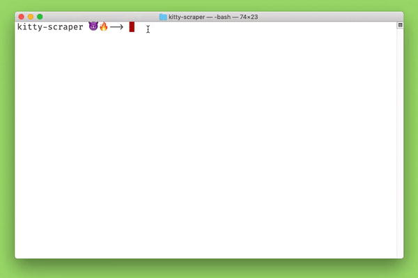

# Kitty Scraper

### Craigslist web scraper for scraping Kitties ~ 😸

# How to install and run the project

1. Install `Python3 +`
2. Clone repo: `git clone https://github.com/kvizconde/Kitty-Scraper.git`
3. Enter project directory `kitty-scraper`
4. Install the required dependencies: `pip3 install -r requirements.txt`
5. Run command: `python3 script.py`

This script will iterate through multiple pages and parse in `kitten and cat` keywords and export the corresponding data into a `csv` file.

### 😽 mmeeooowww 🐈
